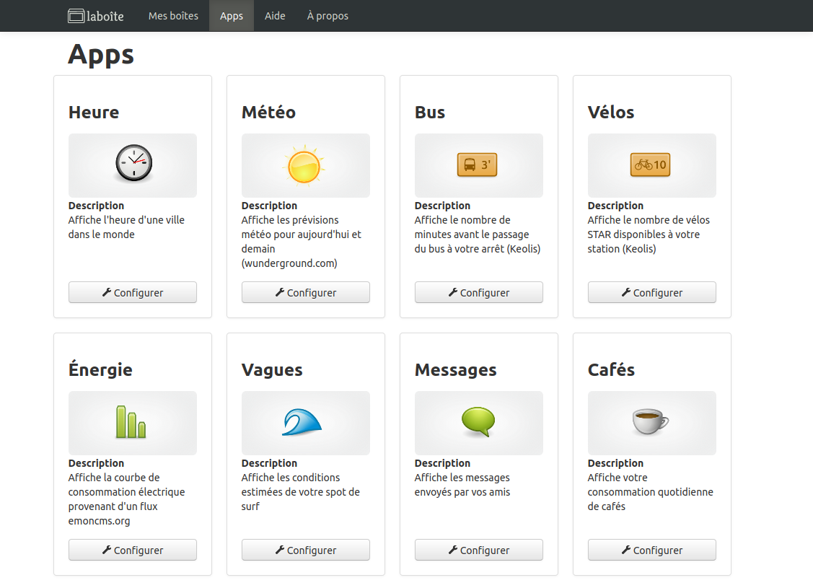

# laboîte.cc

## Qu'est ce que « laboîte classic » ?
**laboîte.cc** est l'application web qui permet de configurer [laboîte classic](/hardware/laboite_classic/).

Cette application géniale est développée par [Baptiste Gaultier](http://baptistegaultier.fr/) dont le plan secret est de conquérir le monde avec ses boîtes.

Le code de cette application est open source ([GPL Affero v3](http://www.gnu.org/licenses/agpl-3.0.fr.html)), ce qui signifie qu'il peut être être téléchargé gratuitement [ici](https://github.com/bgaultier/laboite-webapp), modifié, redistribué et amélioré par tous.

!!! info
    Au fil des ans le projet « laboîte » a beaucoup évolué.
    Nous vous invitons à visiter une version plus récente de la documentation pour obtenir des information sur [lenuage](/software/lenuage.io/) et [laboîte maker](/hardware/laboite_maker/).

    La documentation de [laboîte classic](/hardware/laboite_classic/) et de son application web [laboite.cc](/software/laboite.cc/) reste disponible sur le [site original de laboîte](https://www.laboite.cc/help) !

## Ressources
* [laboîte.cc](https://www.laboite.cc/) : site original de laboîte classic
* [:fontawesome-brands-github: laboite-webapp](https://github.com/bgaultier/laboite-webapp) : dépôt GitHub de l'application web de laboîte classic
* [:fontawesome-brands-github: laboite](https://github.com/bgaultier/laboite) : dépôt GitHub du firmware de laboîte classic
